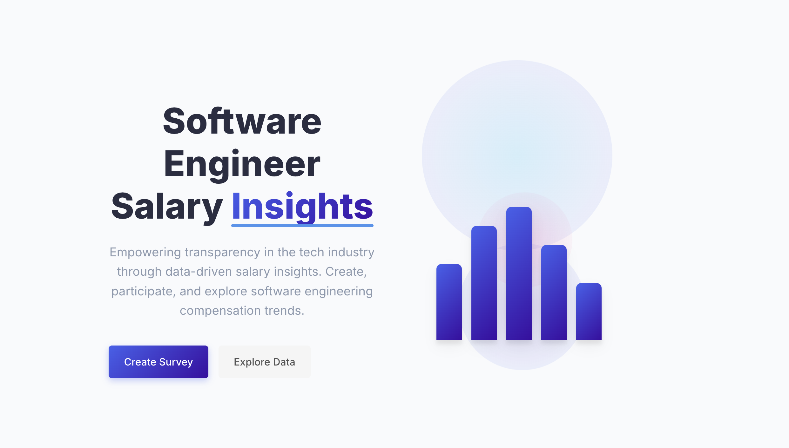

# Software Engineer Salary Survey Frontend

A React application built with Vite that provides a platform for creating, participating in, and viewing results of software engineer salary surveys.



## Features

- **Landing Page**: Entry point to create surveys, view ongoing surveys, or see results
- **Results Page**: Visualizes survey data using Recharts with multiple chart types:
  - Bar charts for salary by experience, role, and location
  - Pie charts for company type distribution
  - Line charts for salary trends over time
- **Create Survey Page**: Form to set up new salary surveys
- **Ongoing Surveys Page**: Displays active surveys with filtering capabilities

## Tech Stack

- **React**: Frontend library
- **TypeScript**: Type safety
- **Vite**: Build tool
- **React Router**: Navigation
- **Recharts**: Data visualization
- **CSS**: Styling (custom, no external UI libraries)

## Getting Started

### Prerequisites

- Node.js (v18 or higher recommended)
- npm (v7 or higher)

### Installation

1. Navigate to the frontend directory:

    ```bash
    cd modules/web
    ```

2. Install dependencies:

    ```bash
    npm install
    ```

3. Start the development server:

   ```bash
   npm run dev
   ```

4. Open your browser and navigate to:

   ```bash
   http://localhost:5173
   ```

## Project Structure

```txt
web/
├── src/
│   ├── components/     # Reusable UI components
│   ├── pages/          # Page components
│   │   ├── Landing.tsx
│   │   ├── Results.tsx
│   │   ├── CreateSurvey.tsx
│   │   └── OngoingSurveys.tsx
│   ├── styles/         # CSS files
│   ├── services/       # API and data services
│   ├── types/          # TypeScript type definitions
│   ├── App.tsx         # Main app component with routes
│   └── main.tsx        # Entry point
├── public/             # Static assets
└── index.html          # HTML entry point
```

## Available Scripts

- `npm run dev` - Start the development server
- `npm run build` - Build for production
- `npm run lint` - Run ESLint
- `npm run preview` - Preview the production build locally

## Future Enhancements

- Authentication system
- More advanced data visualization
- Export results to CSV/PDF
- Data filtering by custom criteria
- Internationalization support
- Dark mode support
